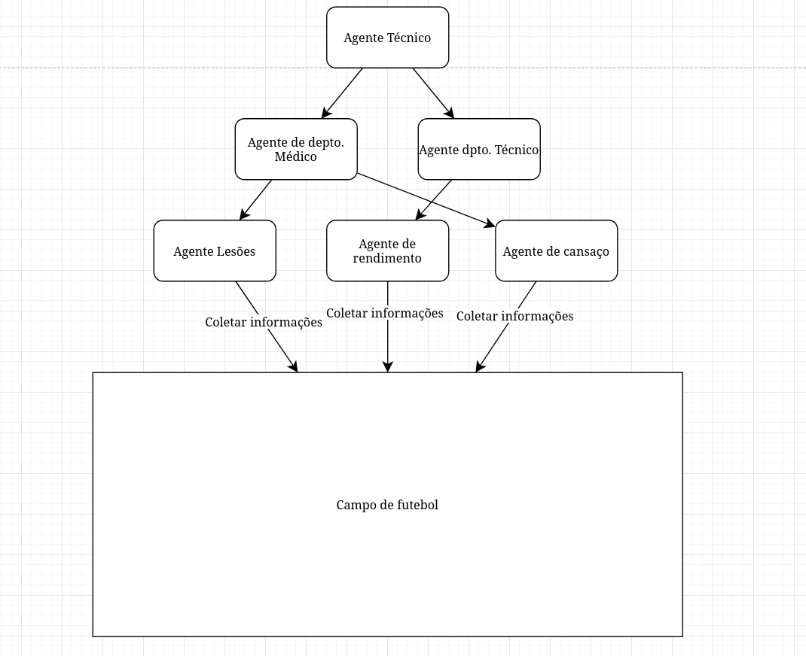

# Atividade: Agentes

# Proposta
Criar um sistema com dois ou mais agentes utilizando a biblioteca MASPY-ml, biblioteca esta, escrita por alunos de mestrado e IC da UTFPR-PG.
O sistema criado no presente repositório vem a ser um sistema multi-agentes (SMA), o sistema em questão tera como dominio a gestão em tempo real de atletas de futebol de uma determinada equipe.
* Objetivos:
1. Verificar quais atletlas estão em campo.
2. Reconhecer/Receber informações de como os atletas estão durante a partida (Ex: Cansados, Bom Rendimento, Baixo Rendimento, Lesionados)
3. Tomar as decisões cabíveis, sobre as informações recebidas.

* Agentes
1. Agente que verifica estado de cansaço dos atletas;
2. Agente que controla desempenho de atletas;
3. Agente que verifica atletas lesionados;
4. Agente que recebe todas as informaçoes e toma as decisões técnicas;
5. Agente que recebe informações e prepara substituições;
6. Agente que recebe informações de lesionados;

# Diagrama



# Bibliotecas
    * MASPY-ml: https://github.com/laca-is/MASPY

# Como rodar via Docker
* Parte-se  da idéia que se tenha instalado o Docker e Docker Compose em seu ambiente de desenvolvimento
* Caso não tenha instalado, siga as instruções na documentação oficial: https://www.docker.com/

1. Execute o container
```bash
docker compose up
``````

# Como rodar manualmente
* Parte-se da idéia que se tenha o python3.12+ instalado no seu ambiente
* Caso não tenha instalado veja na documentação oficial como prosseguir a intalação: https://www.python.org/psf-landing/

1. Execute o clone do repositório
```bash
git clone git@github.com:lsbrel/atividade_agentes
```

2. Vá para o diretório onde se encontra o projeto
```bash
cd atividade_agentes
```

3. (opcional) Crie um ambiente virtual python e ative o mesmo.
```bash
python3.14 -m venv . && source bin/activate
```

4. Instale os pacotes e dependências
```bash
python3.14 -r requirements.txt
```
5. Execute o projeto
```bash
python3.14 src/main.py
``````
